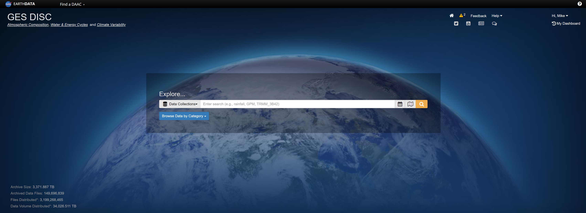
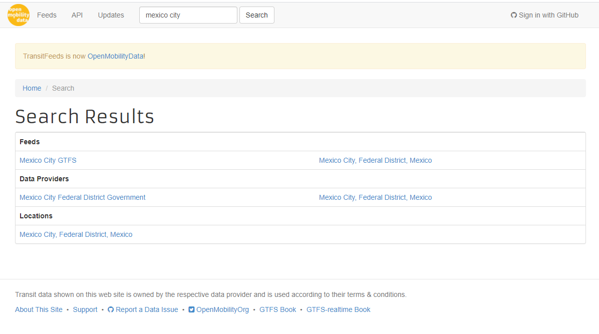

```{r setup, include=FALSE}
knitr::opts_chunk$set(echo = TRUE)
```

## Introduction

This is a guide for data download procedures for the Mexico City NO~2~ modeling project. Currently, the model is being built for the years 2005 to 2019 over the Mexico City Metropolitan Area, but will be updated as necessary.

The guide will be split into multiple sections that covers data downloads from the same sources/websites. Note that there are often multiple methods to download this data: I list below only the method that I chose to use for the downloads. Depending on your machine capacity and operating system, alternative methods may be preferable.

------------------------------------------------------------------------

## Satellite Data (NASA)

This project utilizes three main satellite products: NO~2~ and ozone data from the Ozone Monitoring Instrument (OMI) and finer scale NO~2~ data from the TROPOspheric Monitoring Instrument (TROPOMI). All of these products are available through [NASA's Goddard Earth Sciences Data and Information Services Center](https://disc.gsfc.nasa.gov/) (GES DISC).

Note: to download all data, you must register for an Earthdata Profile, which is available [here](https://urs.earthdata.nasa.gov/users/new).

Once you're on the GES DISC homepage, search for the product that you are looking for. If you know the exact product name, you can enter that into the search box and it will automatically find the corresponding product. If you don't know the exact product name, you can enter the type of product you are looking for, and it will give you all related results.



Let's use the OMNO2d_003 product as an example. After searching, we are brought to this page:


Click on **Subset/Get Data**:


Here, specify the download method, date range, region, and subset of variables that you are interested in downloading (if applicable). The default is to download the entire global dataset for the entire duration for which the dataset is available, which is usually overkill (and can take significantly more time):


Once you click on **Get Data**, in addition to automatically downloading a .txt file, you will be prompted to a page with download links. If you are only requesting a few datasets, you can simply click on the links and download them directly. However, if you are downloading several thousand files at a time, it might drive you crazy. Instead, you can automate the procedure with command prompt.

First, check that the .txt file that you downloaded looks something like this:


Next, open Command Prompt on Windows:


In Command Prompt, change the directory to where you would like the data to be stored using `cd`:


Next, enter the following code, substituting your own Earthdata username (this code should be a single line):

`wget --load-cookies D:\.urs_cookies --save-cookies D:\.urs_cookies --auth-no-`

`challenge=on --keep-session-cookies --user=YOUR USER NAME --ask-password --content-`

`disposition -i subset_S5P_L2__O3_TOT_HiR_2_20201027_161857.txt`

You will then be prompted to enter your Earthdata password. Once you do that, the download will automatically commence. Make sure you have a stable connection to the Internet, as the download process can last up to several days for very large datasets.

------------------------------------------------------------------------

## Monitoring Data (RAMA/SCICA)

Monitoring data for Mexico City is available from two sources: Red Automática de Monitoreo Atmosférico (RAMA) and Sistema de Consulta de Indicadores de la Ciudad del Aire (SCICA). For the purposes of Mexico City, the data from the two sources appears to be the same, with the RAMA data downloading all available data for all pollutants from Mexico City monitors by year (1986 -- 2020), while SCICA has data from monitoring stations across all of Mexico, and allows you to download subsets based on year, location, and air pollutant.

Data from RAMA is available [here](http://www.aire.cdmx.gob.mx/default.php?opc=%27aKBh%27). Select from the drop menu the year of the data you would like to download, and it will download automatically:


Data from SCICA is available [here](http://scica.inecc.gob.mx/exec/addl). Drop menus are available for contaminant, monitoring site, and year. NO~2~ from Mexico City in 1997 is selected here as an example:


------------------------------------------------------------------------

## Column/Meteorological Data (ADS/CDS)

Total column NO, NO~2~, and ozone data were downloaded from the [Copernicus Atmospheric Data Store](https://ads.atmosphere.copernicus.eu/cdsapp#!/home) (ADS), and meteorological data including 2m temperature, 10m u-component/v-component of wind, total precipitation, snow albedo, surface pressure, total cloud cover, and boundary layer height are downloaded from the [Copernicus Climate Data Store](https://cds.climate.copernicus.eu/#!/home) (CDS). The data comes from three datasets:

-   CAMS global reanalysis (EAC4): total column NO, NO~2~, and ozone data

-   ERA5-Land hourly data from 1981 to present: 2m temperature, 10m u-component/v-component of wind, total precipitation, snow albedo, and surface pressure

-   ERA5 hourly data on single levels from 1979 to present: total cloud cover and boundary layer height

The procedure to download data from these two websites are virtually identical, so I will show an example from a CDS download below.

First, install a CDS API Key. This is only necessary when you intend to use the CDS API client for data access (similar to the Command Prompt download), but I actually didn't use this since I was only downloading just a few datasets. The instructions are available [here](https://cds.climate.copernicus.eu/api-how-to#install-the-cds-api-key).

Here is the CDS homepage. Use the search engine on this page, or click on **Datasets** and browse the available datasets.


Once you find your dataset of interest, click on the **Download data** tab.


Here, you can select the variables you need and subset the data and choose the output format as necessary:


Once you made your selections, either click **Submit Form**, or copy the code to download the data:


------------------------------------------------------------------------

## OpenStreetMap

For locations of roads, we are using data from [OpenStreetMap](https://www.openstreetmap.org/export#map=8/19.552/-98.377). This is a relatively straightforward dataset to download. Identify the coordinates for your download. If it is within a certain size, it will be directly available for download. If it exceeds the size (such as in the photo below), there are a number of options available for bulk data downloads:


Alternatively, OpenStreetMap data is directly available to download through QGIS. You can see an example [here](https://www.qgistutorials.com/en/docs/downloading_osm_data.html).

------------------------------------------------------------------------

## Transportation Data

We have obtained General Transit Feed Specification (GTFS) data from [OpenMobilityData](https://transitfeeds.com/). Under **Browse Feeds**, identify the providers that you would like to download data from.


For Mexico City, only one feed is available (Mexico City GTFS). All corresponding data from the feed were downloaded.



An example of how to process GTFS data can be found [here](https://gtfs.org/data-examples/).

------------------------------------------------------------------------

## NDVI/EVI Data

Normalized Difference Vegetation Index (NDVI) and Enhanced Vegetation Index (EVI) data are obtained from the Terra Moderate Resolution Imaging Spectroradiometer (MODIS) Vegetation Indices (MOD13Q1) Version 6. The data is generated every 16 days at 250 meter resolution. More information about the dataset can be found [here](https://lpdaac.usgs.gov/products/mod13q1v006/).

There are many ways to download this dataset, but I utilized [NASA Earthdata Search](https://search.earthdata.nasa.gov/search) for this download. A search of the product name (MOD13Q1 v006) provides the product in the search result:


Under **Granule Filters**, enter `8 6,7` for the MODIS Tiles SIN. This filters the grids to only include those relevant to Mexico City. Click **Download All**:


Similar to the GES DISC download, this will take you to a page where you can click on the individual download links or a .txt file and shell script that can automate the download process. If you have any software that can directly run the shell script (such as Git), paste the shell script into the directory where you want the data to be download, open the script, and the download will proceed directly.

------------------------------------------------------------------------

## Population Data

Population count and density are obtained from the [Gridded Population of the World (GPW), v4](https://sedac.ciesin.columbia.edu/data/collection/gpw-v4/maps/services). This raster product provides \~1x1km grids of population for our area of interest, updated every 5 years from 2000 to 2020. This download was very straightforward, but the website was down at the time when I completed this document. I will add screenshots and instructions for download at a later time.

------------------------------------------------------------------------
